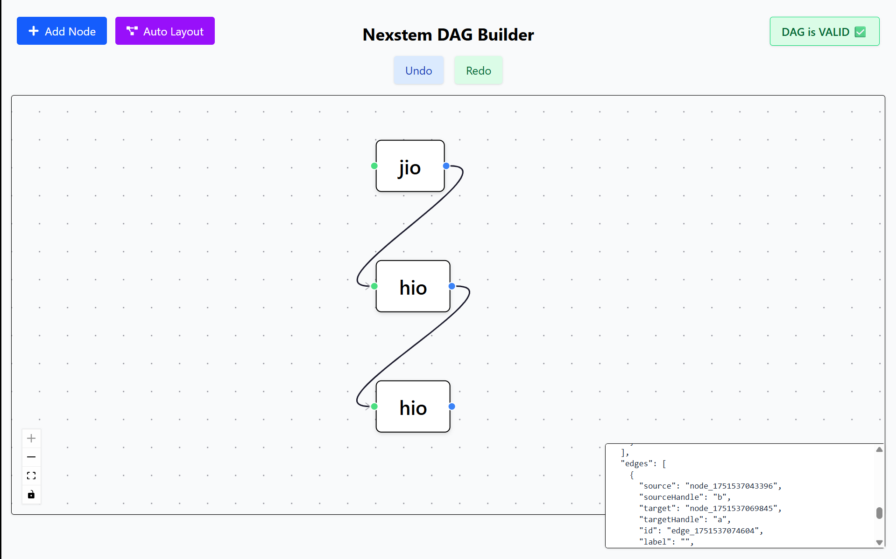
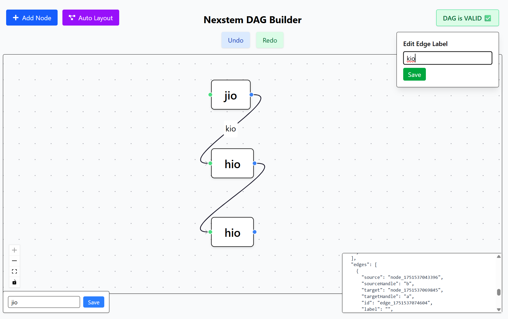
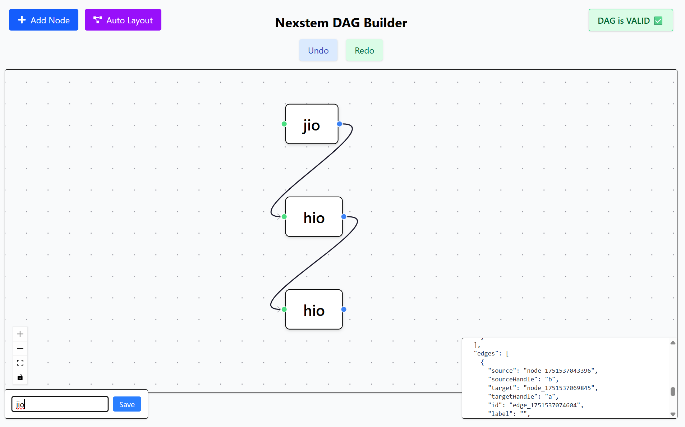
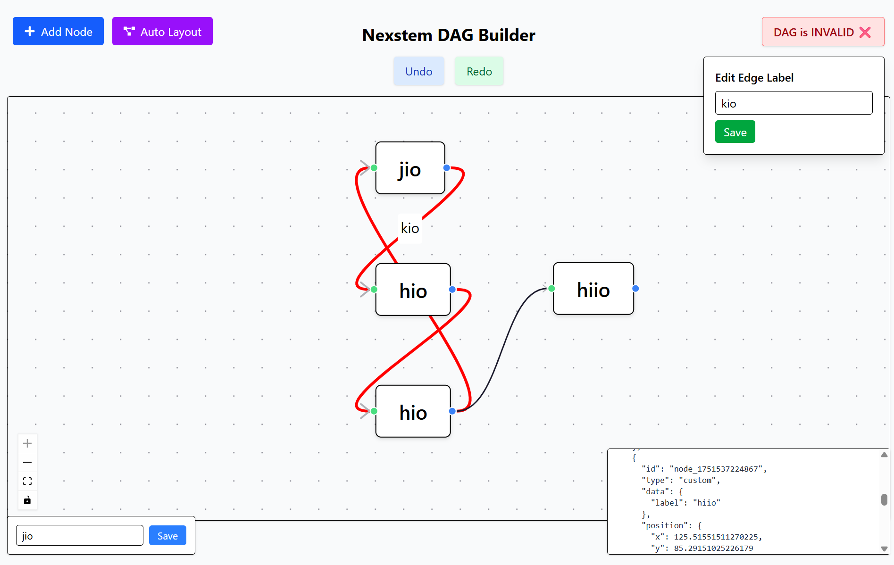

# 🔗 Nexstem DAG Builder

An advanced **DAG (Directed Acyclic Graph) Editor** built using ReactFlow, React 19, and TailwindCSS. Designed for **intuitive graph editing**, it supports:

- ✅ Directed edge constraints
- 🔁 Undo/Redo
- ❌ Cycle detection with **red edge highlighting**
- ✍️ Node & Edge label editing
- ⚙️ Auto-layout with DAGRE
- 🧠 Real-time DAG validation
- 📍 Tracker overlay
- 🖱️ Context menu + drag-and-drop UX

---

## 🛠️ Setup Instructions

```bash
# 1. Clone the repository
git clone https://github.com/serv-er/DAG-builder.git

cd pipeline-editor

# 2. Install dependencies
npm install

# 3. Start the development server
npm run dev


---
```
## 🧰 Tech Stack

| Library                 | Purpose                   |
| ----------------------- | ------------------------ |
| `react@19.1.0`          | Core UI library           |
| `react-dom@19.1.0`      | React DOM rendering       |
| `reactflow@11.11.4`     | DAG visual editor         |
| `dagre@0.8.5`           | Automatic graph layout    |
| `tailwindcss@4.1.11`    | Styling framework         |
| `@tailwindcss/vite`     | Tailwind plugin for Vite  |
| `react-icons@5.5.0`     | Icon library              |
| `react-tooltip@5.29.1`  | Tooltip for better UX     |

---

## ✨ Features

- **Strict Edge Rules:** Source → Target only, no loops or same-side links
- **Cycle Detection:** Cycles are caught instantly and edges are highlighted in red
- **Undo/Redo:** Step through node/edge changes using history stack
- **Auto Layout:** Clean layout with DAGRE to reposition nodes
- **Node & Edge Label Editing:** Double-click and edit inline labels
- **Drag Tracker:** Displays real-time position while dragging a node
- **Context Menu:** Right-click to add node or auto-layout
- **DAG Validity Banner:** Shows whether the current structure is valid
- **Live JSON Preview:** See current nodes and edges as formatted JSON

---

## 📸 Demo
**Sample Screenshots:**
- JSON Preview Panel

- Node & Edge Label Editors



- Cycle Detection with Red Edge



---

## 🧠 Challenges Faced

### 1. Ghost / Invalid Node Injection

**Problem:**  
During node additions or hot reloads, sometimes ReactFlow or extensions injected an invalid node like:

```
{ "id": "node_0", "type": "dimensions", "position": { "x": NaN, "y": NaN } }
```

This caused crashes in layouting and rendered NaN positions.

**Root Cause:**
- Likely injected by React DevTools or unexpected browser extensions
- Occurred during development reload or accidental state corruption

**Solution Implemented:**

We created a strict `isValidNode` function:

```
const isValidNode = (node) =>
node?.id &&
typeof node.id === 'string' &&
node.type !== 'dimensions' &&
node.position?.x !== undefined &&
node.position?.y !== undefined;
```

And inside `useLayoutEffect`, we filtered invalid ones:

```
useLayoutEffect(() => {
const filtered = nodes.filter(isValidNode);
if (filtered.length !== nodes.length) {
const removed = nodes.filter((n) => !isValidNode(n));
removed.forEach((b) => console.warn('🧹 Removed ghost node:', b));
setNodes(filtered);
}
}, [nodes]);
```


**Result:**  
This completely blocked rendering of any unexpected devtool-injected or malformed node.

---

## 📚 References

- React Flow Docs
- DAGRE Layout Algorithm
- DFS Cycle Detection
- Tailwind CSS
- React 19 Beta Docs

---

## 👨‍💻 Author

Made with ❤️ by Sarvesh Baranwal

Feel free to contribute or fork the project if you want to extend the DAG builder further!
